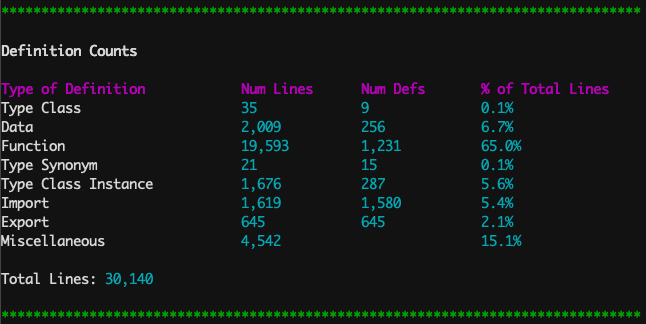
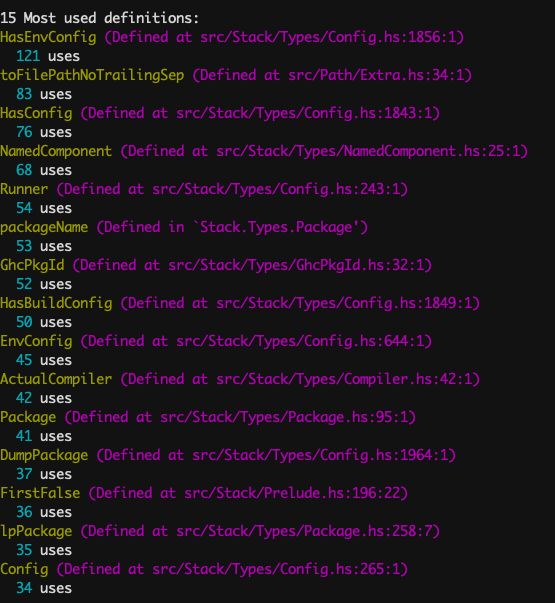
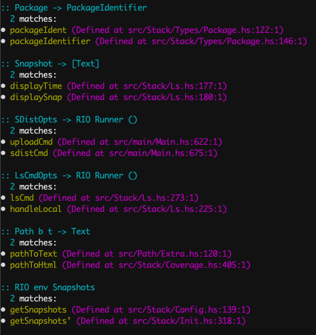

# Inventory

This is a utility that provides a variety of statistics about your Haskell
project. These include:

- A list of type signatures that are shared among multiple functions,
  enumerating those functions along with their definition sites.
- Lists of the most used and least used definitions in the project.
- A breakdown of local definitions, telling you the number of each type of
  definition as well as how many lines of code they take up.

## Using inventory

Inventory uses `.hie` files to gather information about all haskell files in
the project. Once you have generated `.hie` files for your project, execute
`inventory` from your project's root.

## How to generate `.hie` files
### Cabal

Add this to your `cabal.project.local` file:

```
package *
  ghc-options: -fwrite-ide-info -hiedir=.hie
```

Then do a full rebuild of the project:

```
cabal clean
cabal build all
```

### Stack

Add this to your `stack.yaml` file:

```
ghc-options:
  "$locals": -fwrite-ide-info
             -hiedir=.hie
```

Then do a full rebuild:

```
stack clean
stack build
```

## Examples

Here are some excerpts of the output that was produced by running `inventory`
on the `stack` codebase:

### Definition counts


### Most used definitions


### Matching type signatures


The output for matching signatures can be useful for discovering functions that
are duplicates of one another. For instance, the `packageIdent` and
`packageIdentifier` functions in the above output turned out to be duplicates.

### Known Issues/Limitations
- Context such as constraints and foralls do not appear in the printed type
  signatures.
- Standalone kind signatures are not yet included in definition counts.
- GHC versions other than 8.8 and 8.10 are not currently supported.
- Does not unfold type synonyms when comparing type signatures.
